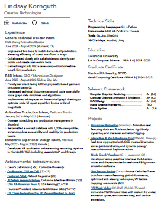
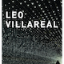

# Hello, my name is Lindsay 

<iframe src="https://avatar-project-one.vercel.app/" width = "700" height = "350"> 
</iframe>

[![SandboxIcon]][SandboxLink]
<!----------------------------------------------------------------------------->
[SandboxLink]: https://codesandbox.io/p/github/likornguth/AvatarProject/main?file=%2Fsrc%2FApp.js&workspaceId=dca2e2fc-dca1-451d-9762-a2fa4b50b229 'Open this project in interactive Code Sandbox Window'
<!---------------------------------[ Buttons ]--------------------------------->
[SandboxIcon]: https://img.shields.io/badge/Code_Sandbox-EF2D5E?style=for-the-badge&color=black&logoColor=white&logo=Square

---

<i>I am a creative technologist based in Los Angeles, CA.  I am passionate about implementing code to optimize artistic workflows, as well as leveraging design concepts to create intuitive and aesthetic interfaces for artists and developers alike.</i>

### Education
 <b>Columbia University</b> ('19-'23) -  <i>Bachelor of Computer Science</i> (GPA: 3.8)

--- 

### Certificates
  <b>Stanford University</b> ('24-'25) - <i> Graduate Certificate in Visual Computing </i> (GPA: 4.3)

---

[![Button Icon5]][Link5]
<!----------------------------------------------------------------------------->
[Link5]: https://www.youtube.com/@liko_music 'Link with example title.'
<!---------------------------------[ Buttons ]--------------------------------->
[Button Icon5]: https://img.shields.io/badge/YouTube-EF2D5E?style=for-the-badge&color=red&logoColor=white&logo=YouTube

[![Button Icon]][Link]
<!----------------------------------------------------------------------------->
[Link]: https://www.linkedin.com/in/lindsay-kornguth-a0885b1a0/ 'Link with example title.'
<!---------------------------------[ Buttons ]--------------------------------->
[Button Icon]: https://img.shields.io/badge/LinkedIn-EF2D5E?style=for-the-badge&color=blue&logoColor=white&logo=LinkedIn

[![Button Icon2]][Link2]
<!----------------------------------------------------------------------------->
[Link2]: https://github.com/likornguth?tab=repositories 'Link with example title.'
<!---------------------------------[ Buttons ]--------------------------------->
[Button Icon2]: https://img.shields.io/badge/GitHub-EF2D5E?style=for-the-badge&color=black&logoColor=white&logo=GitHub

<!---------------------------------[ Buttons ]--------------------------------->
[Button Icon12]: https://img.shields.io/badge/GitHub-EF2D5E?style=for-the-badge&color=black&logoColor=white&logo=GitHub

-------

### Resume

[![Button Example]][Link]
<!----------------------------------------------------------------------------->
[Link]: ./src/Creative_Tech_Resume.pdf 'Link with example title.'
<!---------------------------------[ Buttons ]--------------------------------->

[Button Example]: https://img.shields.io/badge/Open_>-37a779?style=for-the-badge

-------
### <u>Work Experience</u>

 [Walt Disney Animation Studios](https://www.linkedin.com/company/walt-disney-animation-studios/)

- General Technical Director Trainee (2025-2026)

- General Technical Director Intern (2024)

---

   
[CLO Virtual Fashion](https://www.linkedin.com/company/3214836/?lipi=urn%3Ali%3Apage%3Ad_flagship3_profile_view_base%3BB8w%2BpCSzQD%2B3pqPkOuoGrw%3D%3D)
 
- Research & Development Intern (2023)

---

  
 [Partizan Studio](https://www.linkedin.com/company/37907/?lipi=urn%3Ali%3Apage%3Ad_flagship3_profile_view_base%3BB8w%2BpCSzQD%2B3pqPkOuoGrw%3D%3D)

- Animation Production Intern (2023)

---

 

[Leo Villareal Studio](https://villareal.net/)

- Web Graphics Developer (2022)

---

  
[MERGE](https://www.linkedin.com/company/27237129/?lipi=urn%3Ali%3Apage%3Ad_flagship3_profile_view_base%3BoEqCrM7GTX2Uiyiqn29EqQ%3D%3D)

- Immersive Experience Design Intern (2022)

-------

### <u>Volunteer Work</u>

[Columbia University Effective Altruism](https://www.linkedin.com/company/3345128/?lipi=urn%3Ali%3Apage%3Ad_flagship3_profile_view_base%3BoEqCrM7GTX2Uiyiqn29EqQ%3D%3D)

-  AI Research Fellow   (2022)

---

 

 [UCSF Benioff Childrens' Hospital](https://www.linkedin.com/company/3345128/?lipi=urn%3Ali%3Apage%3Ad_flagship3_profile_view_base%3BoEqCrM7GTX2Uiyiqn29EqQ%3D%3D)

- Sports Medicine/PT Assistant (2015-2019)

---

## Press

* [<i>RatRock Magazine</i>: "Featured Artist"](https://www.ratrockmagazine.com/feature/2022/3/26/lindsay-kornguth)
* [<i>United States Chess Federation</i>: "Top 50 Highest Rated Female Players"](https://www.uschess.org/component/option,com_top_players/Itemid,371?op=list&month=1609&f=usa&l=R:Top%20Girls%20Age%2015.&h=Top%20Girls%20Age%2015)
* [<i>USA Fencing</i> "All-American Team  2016-2017" ](https://cdn1.sportngin.com/attachments/document/a123-1653878/All-American_Team_2016-17.pdf)
* [<i>Lamorinda Weekly</i>: "Local Fencer Finishes 3rd at North American Cup"](https://www.lamorindaweekly.com/archive/issue0917/Local-Fencer-Finishes-Third-at-North-American-Cup.html)
* ["Students at Berkeley Chess School Excel in State Competitions": <i>East Bay Times</i> Interview](https://www.eastbaytimes.com/2011/01/13/students-at-berkeley-chess-club-excel-in-state-competitions/)

