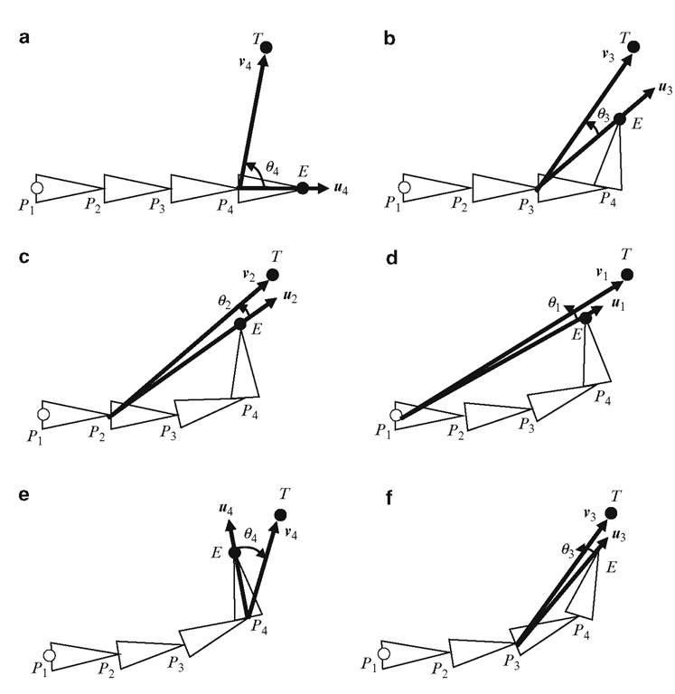

# Web-Based IK Rig & Keyframe Editor:
--- 

<iframe src="https://ik-rig-tool.vercel.app/" width = "700" height = "700"> 
</iframe>

[![Button Example]  ][Link]
<!----------------------------------------------------------------------------->
[Link]: https://ik-rig-tool.vercel.app/ 'Link with example title.'
<!---------------------------------[ Buttons ]--------------------------------->
[Button Example]: https://img.shields.io/badge/Fullscreen_>-37a779?style=for-the-badge

[![Button Icon]][Link2]
<!----------------------------------------------------------------------------->
[Link2]: https://github.com/likornguth/IK_Rig_Tool 'Link with example title.'
<!---------------------------------[ Buttons ]--------------------------------->
[Button Icon]: https://img.shields.io/badge/Github-EF2D5E?style=for-the-badge&logoColor=white&logo=GitHub

[Icon2]: https://img.shields.io/badge/Play-EF2D5E?style=for-the-badge&logoColor=white&logo=Arrow

--- 

### Scene Controls

Orbit controls are implemented for easy control and maneuvering around this 3D scene.  Both the scene and controls are centered about the origin.

| Cmd | Ctrl |
| -----   | ------ |
| Zoom in | <i>Scroll forward</i> |
| Zoom out | <i>Scroll backward</i> |
| Tilt | <i>Drag up/down </i> |
| Pan  | <i>Drag left/right </i>|

### GUI

| Control |  Details |
| ----- | ------|
| Show IK | Toggle on/off to show/hide the mesh skeleton |
| Show Transform | Toggle on/off to show/hide the target object for the rig |
| Parent | Higher of the two bones in the selected joint in the bone hierarchy |
| Child | Lower of the two bones in the selected joint in the bone hierarchy |
| Rotation min/max | Min and Max amount (in radians) the selected joint is allowed to rotate |

### Keyframe Editor

This project provides a JavaScript-based keyframing tool for animating 3D models. The tool allows users to set keyframes at specific times, enabling the creation of smooth animations over time.

| Function | Button |
| ----- | ----- |
| Add Keyframe | <i class="fa fa-solid fa-plus"></i> |
| Remove Keyframe | <i class="fa fa-solid fa-minus"></i> |
| Start Playback | <i class="fa fa-play"></i> |
| Pause Playback | <i class="fa fa-pause"></i>|
| Scrub/Step |<i class="fa fa-solid fa-left-right"></i> |


---


## Project Overview

The project offers technical artists a streamlined toolset for rigging and animating 3D models efficiently. By leveraging inverse kinematics, keyframe animation tools, a user-friendly GUI, and interactive controls, it provides a simple and intuitive environment for creating and manipulating skeletal structures and animations within a web-based 3D graphics application.

## Core Functionalities

### **1.   Rendering and Animation Loop:**

Manages rendering with a timestamp and frame number, incorporating the IK solver and timeline for playback control.

```
function render(timestamp, frame) {
  IKSolver?.update();
  const delta = clock.getDelta();
  if(playing){
    timeline.setTime(start*1000 + (1000*(clock.elapsedTime + delta) % (loopduration*1000)));
  }
  if(mixer){
    mixer.update(delta);
  }
  renderer.render(scene, camera);
}

```

###  **2.   3D Models:**

All 3D Models were custom built for this project with Blender


| imac.glb | succulent.glb |
|------ | ------| 
|   |  |


- Imports 3D models using GLTFLoader.
- Models were imported as .glb files


### **4.   Inverse Kinematics (IK) Implementation:**

#### Algorithm:

A <i>Cyclic Coordinate Descent (CCD)</i> Solver is an algorithm used in 3D graphics and simulations, particularly in rigging for animation and robotics. It's employed in solving the [inverse kinematics](https://www.mathworks.com/discovery/inverse-kinematics.html) problem in multi-joint chains.  It is ideal for real-time/web-based applications due to its efficiency.



- <b>Functionality</b>: The CCD Solver iteratively adjusts joint angles within a chain-like structure, altering one joint at a time to achieve a desired position or orientation for the end-effector.

- <b>Process</b>: It starts from the end-effector and iterates backward, adjusting each joint's angles in a cyclic manner. The adjustments aim to align the end-effector with the target position or orientation.

- <b>Efficiency</b>: CCD is computationally efficient and well-suited for systems with interconnected joints. It often converges rapidly toward the target, especially in systems where simple, iterative solutions are effective.


**THREE.js CCDIK Implementation:**


<iframe width = "680" height = "350" src="https://threejs.org/docs/scenes/ccdiksolver-browser.html"></iframe>

---

- Utilizes a CCD IK solver for manipulating skeletal structures.

        const iks = [
            {
                target: 5, // "target"
                effector: 4, // "bone3"
                links: [ { index: 3 }, { index: 2 }, { index: 1 } ] // "bone2", "bone1", "bone0"
            }
        ];

- Constructs bone hierarchies

            // Bones hierarchy:
            //
            //   root
            //     ├── bone0
            //     │    └── bone1
            //     │          └── bone2
            //     │                └── bone3
            //     └── target

   - Allows position transformations of IK target object

            // Positioned as follow on the cylinder:
            //
            //        o      <- target      (y =  20)
            //        
            //   +----o----+ <- bone3       (y =  12)
            //   |         |
            //   |    o    | <- bone2       (y =   4)
            //   |         |
            //   |    o    | <- bone1       (y =  -4)
            //   |         |
            //   +----oo---+ <- root, bone0 (y = -12)

#### **Joint Constraint :**

- IK calculations with unlimited joint rotation are unstable and difficult for 3D animators to control 
- The solver will often produce undesirable effects when pushed to extremes of possible joint configurations:

| Loose Constraints | Tight Constraints |
| -------| -------|
| <iframe src="https://giphy.com/embed/9garbt4m3DkIL61Drb" width="480*0.9" height="316*0.9" frameBorder="0" class="giphy-embed" allowFullScreen></iframe><p></p> | <iframe src="https://giphy.com/embed/JdTZDl9BqrQkOOx2E8" width="480*.9" height="316*.9" frameBorder="0" class="giphy-embed" allowFullScreen></iframe><p></p> |

#### **Solution: Custom Flexibility:**

- Setting a limit on the range of motion of each joint increases the overall stability of the IK rig
- GUI panel contains joint-wise rotation constraint adjustments.
- Parent child relationships are exposed in the menu as well

---

## Keyframe Editor Implementation

### Functionality

The tool uses the `animation-js` javascript package to manage keyframes and timeline interactions. Keyframes are stored as time-value pairs, representing the position of the 3D model at specific points in time. Playback controls manage the animation flow, utilizing the provided clock to control timing.

### Key Components

#### Timeline 

-  interface that displays keyframes and manages animation time.


        let positionKF = new VectorKeyframeTrack( ".position", times, values )
        let rows = [
            {
                keyframes: [
                    { 
                        val: 0, 
                    },
                ]
            }
        ];

        timeline = new timelineModule.Timeline({id:'timeline'})
        timeline.setModel({ rows: rows });


### Toolbar Functions
The code is structured into functions for:

**`setUpAnimation()`** : Initialize keyframe tracks and turns IK target position into keyframable attribute

```
function setupAnimation(){
  const positionKF = new VectorKeyframeTrack(
    ".position",
    times,
    values
  )
  const tracks = [positionKF];
  const length = -1;
  const clip = new AnimationClip("movetarget",length,tracks);
  mixer = new AnimationMixer(handleBone);
  action = mixer.clipAction(clip);
}
```

**`addKeyframe()`**: Adding keyframes based on the current time and model position.

```
function addKeyframe() {
    if (timeline) {
      const currentModel = timeline.getModel();
      currentModel.rows[0].keyframes.push({ val: timeline.getTime() });
      timeline.setModel(currentModel);

      values.push(handleBone.position.x, handleBone.position.y, handleBone.position.z);
      times.push(timeline.getTime()/1000);

      // if loop is affected, update the start, end and duration
      start = Math.min.apply(Math, times);
      end = Math.max.apply(Math, times);
      loopduration = end - start;

      // replace old keyframe track with updated one
      tracks = [new VectorKeyframeTrack(
        ".position",times,values)];
      length = -1;

    }
  }

```

---

**`removeKeyframe()`** : Removing selected keyframes from the timeline.

```
function removeKeyframe() {
      
      // delete values and times entry
      let temp = [];
      let idx;
      for(const i in times){
        //console.log(i,t);
        if(times[i]!=t){
          temp.push(Number(times[i]));
        }
        else{
          // save index so we know which values to remove
          idx = i;
        }
      }
      times = temp;
      console.log("after:", times);

      let temp2 = [];
      for(const j in values){
        // x y and z of position vector at index i (each index has width 3)
        if(j != 3*idx){
          if(j!= 3*idx+1){
            if(j!= 3*idx +2){
              temp2.push(Number(values[j]));
            }
          }
        }
      }
    }

```

---

**`onPlayClick()`/ `onPauseClick()` **: Handling play, pause, and time update events.

```
function onPlayClick(event) {
    action.play();
    clock.start();

    playing = true;

    start = Math.min.apply(Math, times);
    end = Math.max.apply(Math, times);
    loopduration = end - start;

    if (timeline) {
      // Don't allow to manipulate timeline during playing (optional).
      timeline.setOptions({ timelineDraggable: false });
    }
}

```
**`interpolate()`** : Interpolates between keyframes to create smooth animation transitions: 

    function interpolate(start, end, t){

        const x = start.x + (end.x - start.x) * t;
        const y = start.y + (end.y - start.y) * t;
        const z = start.z + (end.z - start.z) * t;
        return new THREE.Vector3(x, y, z);
    }
**`timeline.onTimeChanged()`** : For scrubbing/stepping through paused timeline:

        onTimeChanged(){
            time = timeline.getTime();
            min = timeline.values.getMax();
            max = timeline.values.getMin();

            // minmax problem:
            // max = maximum value less than time
            // min = minimum value greater than time

            if(time < min && time > max){

                let minidx, maxidx;

                for(const k in kf){

                    let currval =kf[k].val;
                    if(currval <= min && currval > time){
                        // upper bound
                        min = kf[k].val;
                        minidx = k;
                    }
                    if(currval >= max && currval < time){
                        // lower bound
                        max = kf[k].val;
                        maxidx = k;
                    }
                }

                const v1 = new THREE.Vector3(values[3*minidx],values[3*minidx+1],values[3*minidx+2]);
                const v2 = new THREE.Vector3(values[3*maxidx],values[3*maxidx+1],values[3*maxidx+2]);
        
                const t = (time-max)/(min-max);
 
                currPos = interpolate(v2, v1,t);

                handleBone.position.x = currPos.x;
                handleBone.position.y = currPos.y;
                handleBone.position.z = currPos.z;
            }

        }
        


The tool offers an intuitive interface 


### Technologies Used
- **`WebGL`:** Renders 3D graphics in the browser.
- **`Three.js`:** JavaScript library for 3D graphics.
- **`GLTF`:** Efficient file format for 3D scenes and models.
- **`dat.gui`:** interactive GUI controls
- **`animation-timeline-js`:** Javascript package for users to create and manage keyframed animations for 3D models.

## Conclusion
This project offers technical artists a robust toolset for rigging and animating 3D models. Leveraging inverse kinematics, an intuitive GUI, and interactive controls, it provides a comprehensive environment for creating and manipulating skeletal structures and animations within a web-based 3D graphics application.
