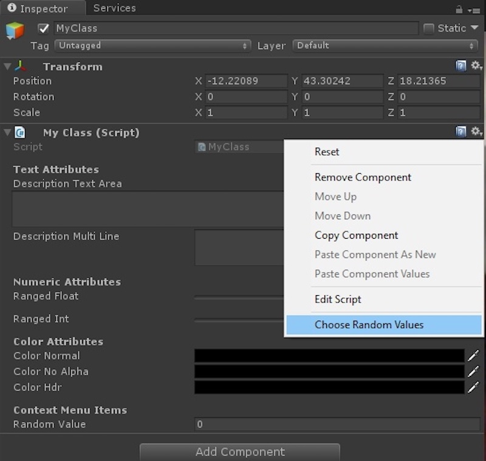

# Node Graph Visualizer

[![Button Icon]][Link]
<!----------------------------------------------------------------------------->
[Link]: https://www.youtube.com/embed/HsE-eUiugmg?si=4fexdFALnTN6kXFV 'Link with example title.'
<!---------------------------------[ Buttons ]--------------------------------->
[Button Icon]: https://img.shields.io/badge/YouTube-EF2D5E?style=for-the-badge&logoColor=white&logo=YouTube

# Node Graph Visualizer

## 1. Introduction
- The Node Graph Visualizer is a graphical user interface that visually displays relationships between nodes in a [Dependency Graph software architecture](https://en.wikipedia.org/wiki/Dependency_graph) 
- The <b>Dependency Graph</b> (aka "Node Graph") structure is the industry standard for developing  graphics applications

- The corresponding <b>Visualizer </b> is simply a user-friendly and code-free interface that can be used to manipulate nodes in real-time rendering applications .

- <u>Maya</u>, <u>ZBrush</u>, <u>Houdini</u>, <u>Blender</u>, <u>Unity</u>, <u>Cinema 4D</u>, and most other 3D Content Creation tools use a Dependency Graph for their codebase due its efficiency, flexibility, and compatibility with graphics applications.

    - These softwares also include a code-free interface for technical users to create custom nodes and plug-ins.  For example, Autodesk Maya's <i>Hypershade</i> was the blueprint for this visualizer project.

|   <i>Hypershade</i>   |
|------|
||

----- 

## 2. Goals and Objectives
- The UI design goals were:
    - Create an intuitive and aesthetic interface for developers 
    - Streamline workflows and improve productivity
    - Enable easy integration with existing C++ codebase
- Implementation Objectives:
    - Smart Default Layout 
    - Draggable Nodes
    - Pin Objects
    - Instantiate new nodes
    - Draw Connections
    - Delete Nodes/Connections
    - Edit Plug Attributes
    - View Plug Attributes

------- 

## Key Features

### Viewing Modes

1. <b>Simple</b>
    - Displays only one input plug and output plug
    - Remaining plugs are hidden

2. <b>Connected</b>
    - Displays only the input/output plugs that are actively connected

3. <b>Full</b>
    - Displays all input/output plugs regardless of connection status

------

### Attribute Editor

All Node-Based 3D Software architectures with a visual interface feature some kind of editor to customize node parameters.  You may recognize this menu in Unity's UI:

|   Unity Attribute Editor   |   My Attribute Editor   |
|-------|-------|
|  |       |

- Users are able to select a specific plug in a node and access its data objects, parameters, and variable name
- Users can also click the <u>Affects ></u> button on the top right to view which downstream nodes are dependent on the selected plug

### Smart Default Layout Algorithm

- The previous examples have been relatively simple in scale and complexity
- A good visualizer should be scalable to handle the rendering demands of large node networks

### Question: How to draw the prettiest graph?

First, let's define the constraints of an aesthetic graph

1. <b> Layer Assignment</b>: There should be a clear hierarchy of nodes, where each node is assigned to a layer and each node is dependent only on nodes that reside in a preceding layer.
    - This layout improves readability by introducing a uni-directional flow of information (left to right or top down)
    - In Dependency Graph programming, it is crucial to see which nodes are further 'downstream' for debugging purposes

1. <b>Crossing Reduction</b>: Ideally, there should be no crossing of the connections between nodes.  If crossing elimination is impossible, then the nodes should be drawn in a way that minimizes crossings

### Best Approach

The optimal solution to the Layered Graph Drawing problem is known as the <b>Sugiyama Technique</b>.  I used the set of algorithms described in this paper: [An Efficient Implementation of Sugiyama’s
Algorithm for Layered Graph Drawing (Eiglsperger et al. , 2005)](https://jgaa.info/accepted/2005/EiglspergerSiebenhallerKaufmann2005.9.3.pdf)

NOTE: This algorithm only works for Directed Acyclic Graphs (DAG) , so the first step in implementation is to identify eliminate all existing cycles.

------

## Video Demo

<iframe width="560" height="315" src="https://www.youtube.com/embed/HsE-eUiugmg?si=4fexdFALnTN6kXFV" title="YouTube video player" frameborder="0" allow="accelerometer; autoplay; clipboard-write; encrypted-media; gyroscope; picture-in-picture; web-share" allowfullscreen></iframe>
---- 

## 3. Technical Specifications
### Tools and Technologies:
- Qt Design Studio: Version 4.0
- Qt Framework: Version 6.6
- Programming Language: C++, qml
### Platform Compatibility:
- Windows, macOS, Linux
- Ensure responsiveness across various screen sizes and resolutions

### User Interface Design Guidelines:
- Consistent UI/UX design adhering to best practices
- Accessibility considerations for differently-abled developers

- Explanation of the research paper on graph layout algorithms
- Integration of graph layout algorithms into the GUI
- Details on the implementation approach and its relevance to the project
- Expected impact on the GUI's usability and functionality

## 5. Development Phases
### Phase 1: Planning and Design
- Requirement gathering and analysis
- UI/UX wireframing and prototyping using Qt Design Studio
- Feedback collection and iterations
### Phase 2: Implementation
- Front-end development using Qt Design Studio
- Integration of backend functionalities (if applicable)
- Implementation of graph layout algorithms
- Continuous testing and debugging
### Phase 3: Quality Assurance and Testing
- Comprehensive testing across multiple platforms
- Usability testing with target users (developers)
- Bug fixing and performance optimization
### Phase 4: Deployment and Documentation
- Packaging the GUI for different platforms
- Preparation of user documentation and guidelines
- Release and deployment strategies

## 6. Risk Assessment and Mitigation
- Identification of potential risks:
    - Compatibility issues with different operating systems
    - Complexity in integrating version control systems
    - User acceptance challenges due to UI/UX design
- Strategies for risk mitigation:
    - Regular testing and compatibility checks
    - Collaboration with version control system providers
    - Continuous user feedback and iterative design improvements

## 7. Timeline and Milestones

## 9. Conclusion
- The Design Goals for the project were to make an intuitive, readable, and aesthetic interface for Dependency Graph programming. I accomplished the following:
    - Functioning user interface with draggable, instantiable, and customizable nodes and connections
    - C++ compatible 
    - Node Graph layout algorithm implemented
- This project will increase developer productivity by providing an easy-to-use interface that streamlines 3D development workflows
- Future considerations and potential enhancements:
    - More plug and data types
    - Complex objets

## 10. References and Appendices
- [An Efficient Implementation of Sugiyama’s
Algorithm for Layered Graph Drawing (Eiglsperger et al. , 2005)](https://jgaa.info/accepted/2005/EiglspergerSiebenhallerKaufmann2005.9.3.pdf)
- [Layered Graph Drawing (Wikipedia)
](https://en.wikipedia.org/wiki/Layered_graph_drawing)

