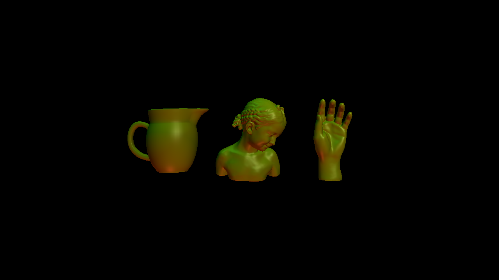

# OpenGL Mesh Viewer

## OpenGL-based Mesh Viewer Implementation

[![Button Icon]][Link]
<!----------------------------------------------------------------------------->
[Link]: https://github.com/likornguth/OpenGL_MeshViewer 'Link with example title.'
<!---------------------------------[ Buttons ]--------------------------------->
[Button Icon]: https://img.shields.io/badge/Github-EF2D5E?style=for-the-badge&logoColor=white&logo=GitHub

---- 
### Objective
The task involves creating an OpenGL-based mesh viewer capable of displaying multiple models simultaneously, each shaded using the Blinn-Phong illumination model. User interaction functionalities, such as mouse-driven model rotation and camera movement, are also implemented. The viewer is expected to load models, apply transformations for scaling and positioning, and render them alongside interactions and appropriate lighting effects.

---- 

### Components and Implementation
1. Model Loading and Display

    - The application loads models provided as command-line arguments and arranges them uniformly within a 2x2x2 cube centered at the origin.

    - A new TriMesh class manages model loading (Load), bounding box calculation (GetBoundingBox), OpenGL buffer handling (DeleteGLBuffers, UpdateGLBuffers), and rendering (DrawGL).
    Shading and Lighting

    - Implements the Blinn-Phong shading model for each model, computed within the fragment shader, resulting in smoother color transitions and improved specular highlights.
    - Utilizes three point lights with varying positions and colors to illuminate the models, enhancing their visual appearance.

1. User Interaction

    - Model Rotation: Allows users to click and drag the mouse to rotate the models around the origin. The x and y changes in mouse coordinates determine the rotation matrices applied to the models.
    - Camera Movement: Incorporates keyboard input (x and z keys) to adjust the camera's distance from the origin along the z-axis, preventing the camera from moving too close to the models.
    - Reset Functionality: Pressing the spacebar resets both the model rotations and the camera position.
    Camera Setup

    - Initially positions the camera at (0, 0, 2), looking at the origin along the -z direction, with an up-vector of (0, 1, 0), and a vertical field of view of 60 degrees.

--------


## TriMesh Class Overview

### Constructors and Destructors

- **Constructor:** `TriMesh(const std::string &name)`: Initializes a `TriMesh` object with a specified name. Sets the name as "TriMesh" if no name is provided.
- **Destructor:** `~TriMesh()`: Cleans up OpenGL buffers by calling `DeleteGLBuffers()`.

### Public Member Functions
```
void
TriMesh::GetBoundingBox(Vec3r &bmin, Vec3r &bmax)
{
    // iterate over every vertex
    for (auto vit =  vertices_begin(); vit != vertices_end(); ++vit){
      Vec3r point = this->point(*vit);
      bmin[0] = std::min(bmin[0], point[0]);
      bmin[1] = std::min(bmin[1], point[1]);
      bmin[2] = std::min(bmin[2], point[2]);
      bmax[0] = std::max(bmax[0], point[0]);
      bmax[1] = std::max(bmax[1], point[1]);
      bmax[2] = std::max(bmax[2], point[2]);
    }
}
```
- **`GetBoundingBox(Vec3r &bmin, Vec3r &bmax)`:** Computes the bounding box of the mesh by iterating over each vertex and updating the minimum and maximum coordinates.

```
bool 
TriMesh::Load(const fs::path &filepath)
{
  OpenMesh::IO::Options opts = OpenMesh::IO::Options::VertexTexCoord |
    OpenMesh::IO::Options::VertexNormal |
    OpenMesh::IO::Options::FaceNormal;

  // save name
  filepath_ = filepath;

  // request vertex texture coordinates
  request_vertex_texcoords2D();

  // request vertex and face normals
  request_vertex_normals();

  request_face_normals();

  // read in mesh
  auto filename = filepath_.string();
  spdlog::info ("loading {}...", filename);

  // check if the mesh file contained vertex (or face normals) normals
  // if not, compute normals
  if(!opts.check(OpenMesh::IO::Options::FaceNormal))
    update_face_normals();
  if(!opts.check(OpenMesh::IO::Options::VertexNormal))
    update_vertex_normals();
  if (has_halfedge_normals())
    update_halfedge_normals();

  return true;

}
```
- **`Load(const fs::path &filepath)`:** Loads a mesh from a specified file path, reading the mesh data and computing normals if needed.

```
bool TriMesh::ComputeFaceNormals()
{
  auto FaceNormal = [&](TriMesh::FaceHandle fh) {
    auto heh = halfedge_handle(fh);
    Vec3r p0 = point(from_vertex_handle(heh));
    Vec3r p1 = point(to_vertex_handle(heh));
    auto vh2 = to_vertex_handle(next_halfedge_handle(heh));
    Vec3r p2 = point(vh2);
    Vec3r face_normal = (p1 - p0).cross(p2 - p0);
    return face_normal.normalized();
  };

  if (!has_face_normals())
    return false;
  for (auto fit = faces_begin(); fit != faces_end(); ++fit)
    set_normal(*fit, FaceNormal(*fit));
  return true;
  
}
```
- **`ComputeFaceNormals()`:** Computes face normals for the mesh.

```
bool TriMesh::ComputeVertexNormals()
{
  auto VertexNormal = [&](TriMesh::VertexHandle vh) {
     Vec3r vertex_normal{0, 0, 0};
     for (auto vfit = vf_iter(vh); vfit.is_valid(); ++vfit)
       vertex_normal += normal(*vfit);
     vertex_normal.normalize();
     return vertex_normal;
  };

  if (!has_vertex_normals() || !has_face_normals())
    return false;
  for (auto vit = vertices_begin(); vit != vertices_end(); ++vit)
    set_normal(*vit, VertexNormal(*vit));
  return true;

}
```
- **`ComputeVertexNormals()`:** Computes vertex normals for the mesh based on face normals.


### Internal Data Members

- **OpenGL Buffer IDs:** `positions_normals_vbo_`, `faces_ebo_`: IDs for vertex and element buffer objects used by OpenGL.
- **Mesh Information:** `filepath_`, `name_`: Filepath and name of the mesh.
- **GL Buffer Status:** `gl_buffers_dirty_`: A flag indicating if OpenGL buffers need updating.

### External Dependencies

- **External Libraries:** `spdlog`, `boost::filesystem`.
- **OpenGL Utilities:** `GLDrawData`, `GLShader`.


--------

## Main (`main.cc`) Overview

### Functions

```
void
GetViewAndProjectionMatrices(glm::mat4 &view_matrix, glm::mat4 &proj_matrix)
{
  // compute aspect ratio
  float aspect = static_cast<float>(window_size_g[0]) /
    static_cast<float>(window_size_g[1]);
  view_matrix = glm::lookAt(glm::vec3(0, 0, camera_z_pos), glm::vec3(0, 0, -2), glm::vec3(0, 1, 0));
  proj_matrix = glm::perspective(static_cast<float>(60.0 * kDEGtoRAD), aspect,
                                 0.01f, 50.0f);
}
```
- **`GetViewAndProjectionMatrices`**: Computes view and projection matrices based on window dimensions.

```
Mat4r
TransformMesh(int index, TriMesh::Ptr m)
{
  // scale to fit inside unit cube
  Mat4r scale_xform{Mat4r::Identity()};
  int i = 0;
  TriMesh::Ptr mesh = m;
  // find current mesh by index... 

  Vec3r bmin, bmax;
  mesh->GetBoundingBox(bmin, bmax);
  Real xdim = bmax[0]-bmin[0];
  Real ydim = bmax[1]-bmin[1];
  Real zdim = bmax[2]-bmin[2];
  // // scale so that the maximum dimension = 1;
  auto maxdim = std::max(xdim,ydim);
  maxdim = std::max(maxdim, zdim);
  Real scale = 2.0 / maxdim;
  
  scale /= i;
  scale_xform.diagonal() = Vec4r{scale, scale, scale, 1};


  Vec3r center = scale*(bmin + 0.5*(bmax-bmin)); // midpoint of longest line
  double size = 2.0; // objects must fit within 2x2x2 box
  double xshift = index*(size/i) + size/(i*2) - size/2; // placement of object along x-axis
  Mat4r translate_xform{Mat4r::Identity()};
  
    // Compute Transformation Matrices (RotateX, RotateY, Translate, Scale)
    // ...

  mesh_xform_g = translate_xform *  rotate_y_xform * rotate_x_xform * scale_xform ;


  return (rotate_y_xform * rotate_x_xform * translate_xform * scale_xform );
  // meshlist_xform_g.push_back(mesh_xform_g);
  

}
```


- **`TransformMesh`**: Function to transform mesh based on user input


```
Mat4r
ResetMesh(int index, TriMesh::Ptr m)
{
    int i = 0;
    TriMesh::Ptr mesh = m;
    // find current mesh by index ...
    
    delta_x = 0;
    delta_y = 0;

    Mat4r total_rotate_x_xform{Mat4r::Identity()};
    // Compute rotation x matrix ... 

    Mat4r total_rotate_y_xform{Mat4r::Identity()};
    // Compute rotation y matrix ... 

    Mat4r inv_rotate_x_xform = total_rotate_x_xform.inverse();
    Mat4r inv_rotate_y_xform = total_rotate_y_xform.inverse();

    return (inv_rotate_y_xform * inv_rotate_x_xform);
    
}
```
- **`ResetMesh`**: Function to reset transformation on meshes based on previous changes made
```
void
UpdateSphere(Real glfw_time)
{
  // scale 2x along x-axis
  Mat4r scale_xform{Mat4r::Identity()};
  scale_xform.diagonal() = Vec4r{2, 1, 1, 1};

  // rotate around y-axis based on current time
  Real rotation_speed = 90;  // 90 degrees per second
  Mat4r rotate_y_xform{Mat4r::Identity()};
  Real rotate_y_angle = glfw_time * rotation_speed;
  // Calculate Rotation Matrix

  // rotate around z-axis based on current time
  rotation_speed = 30;  // 30 degrees per second
  Mat4r rotate_z_xform{Mat4r::Identity()};
  Real rotate_z_angle = glfw_time * rotation_speed;
  // Calculate Rotation Matrix

  // compose sphere's transformation matrix
  sphere_xform_g = rotate_z_xform * rotate_y_xform * scale_xform;
}
```
- **`UpdateSphere`**: Updates the transformation of a sphere based on time.


### Main Function
The main function initializes the OpenGL window, sets up the VAO, creates objects (spheres and meshes), sets materials and lights, and runs the main rendering loop.

The result is an interactive 3D rendering application where you can manipulate objects using keyboard inputs and mouse interactions. It supports rendering spheres and meshes with materials and lighting in an OpenGL context.

The code structure includes functionality for handling different types of 3D objects, setting up materials, and handling user inputs to interact with the rendered scene.


### Technical Implementation Notes
1. Shader Implementation
    - Implements new vertex and fragment shaders to facilitate the Blinn-Phong shading model for enhanced visual quality and lighting effects.

1. OpenGL Rendering
    - Utilizes OpenGL functionality to manage and display meshes, leveraging vertex buffer objects for efficient rendering.
1. User Interaction Handling
    - Incorporates GLFW callbacks for mouse button and cursor position events to manage model rotation.
    - Manages keyboard input to adjust the camera's distance from the models and reset functionalities.

### Result and Recommendations
The completed assignment provides a functional OpenGL-based mesh viewer capable of loading, positioning, and shading multiple models using the Blinn-Phong illumination model. It offers interactive features for user-controlled model rotation and camera movement, ensuring a dynamic and immersive viewing experience. Recommendations for further improvements might include optimizations for rendering performance, additional shader effects, or extending the application's functionality to support more complex meshes or textures.