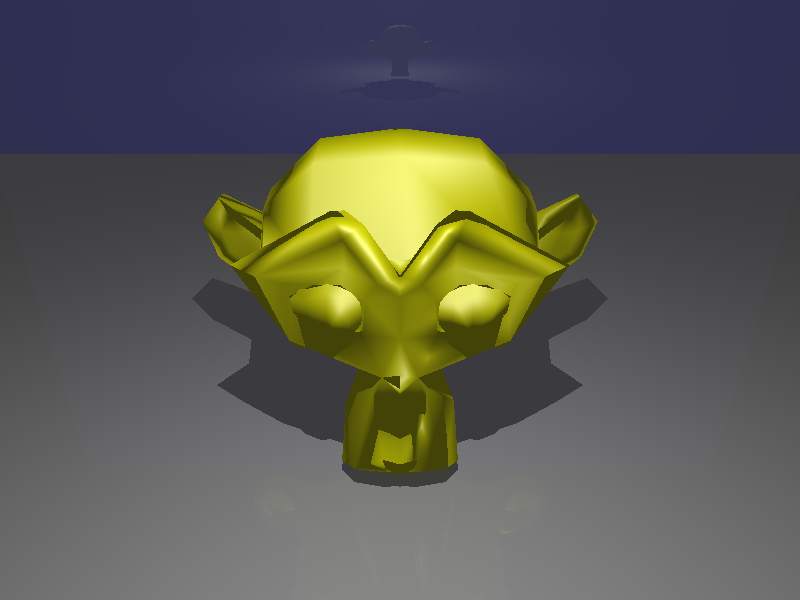
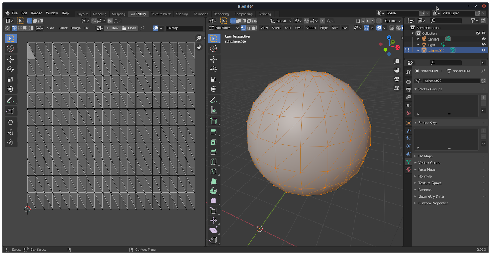
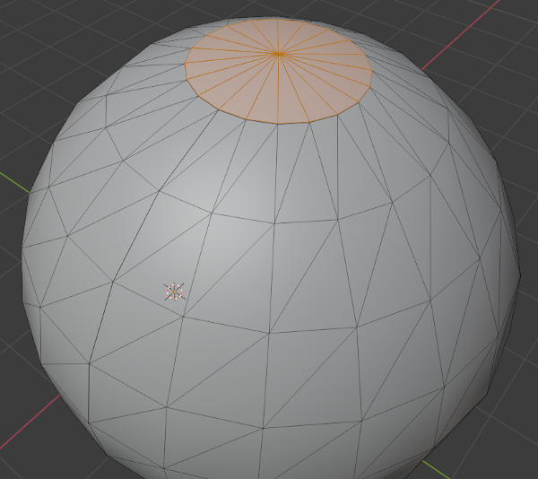
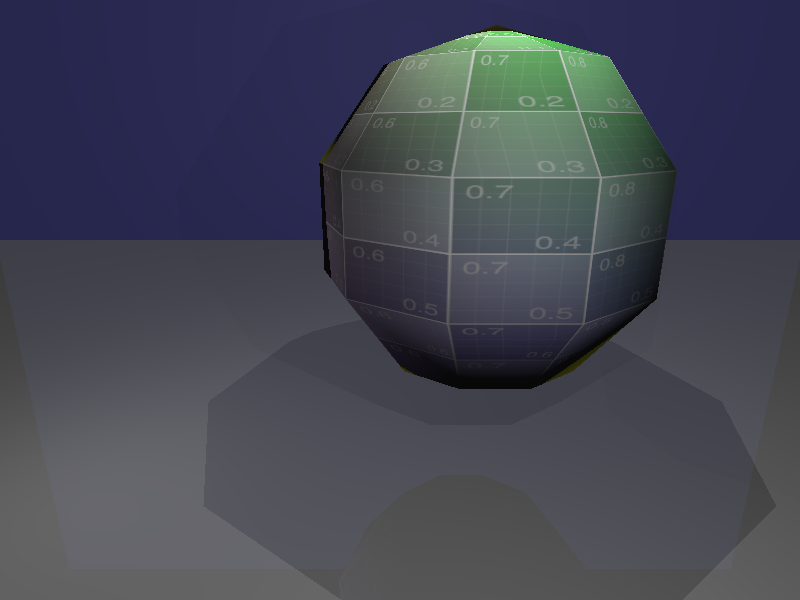
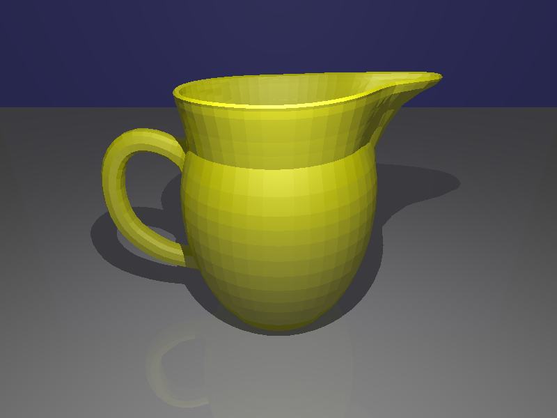
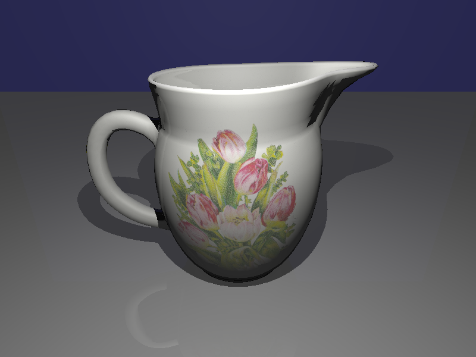
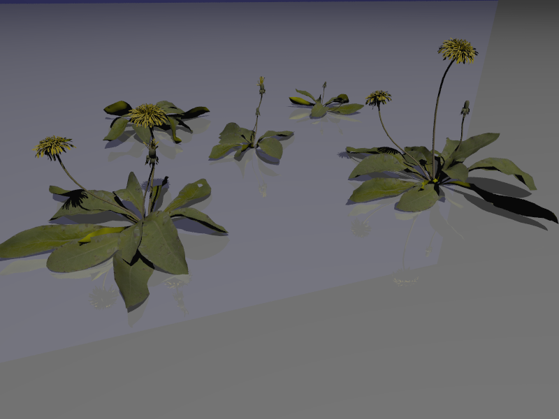

# C++ Ray Tracer
[![Button Icon]][Link2]
<!----------------------------------------------------------------------------->
[Link2]: https://github.com/likornguth/Ray_Tracer_Basic/tree/main 'Link with example title.'
<!---------------------------------[ Buttons ]--------------------------------->
[Button Icon]: https://img.shields.io/badge/Github-EF2D5E?style=for-the-badge&logoColor=white&logo=GitHub

## Part 1: Antialiasing

### Implementation Updates:
- Modified main.cc in src/rtbasic to incorporate the -a command-line argument for defining the number of samples per pixel.
- Introduced `RayTracer::SetNumSamplesPerPixel() `and necessary data members to control the samples per pixel for antialiasing.
- Altered `RayTracer::Render() `to generate multiple random rays through each pixel for antialiasing, enhancing image quality.
----- 

## Part 2: TriMesh

### TriMesh Functionality:

Implemented TriMesh functionalities (`Hit`, `RayFaceHit`, `Save`, `Load`, `GetBoundingBox`, `ComputeFaceNormals`, `ComputeVertexNormals`) in `trimesh.cc`.
Enhanced scene parser (`raytra_parser.cc`) to load triangle meshes using the `w` command.
Generated and verified rendering for `sphere_mesh.scn` and `suzanne.scn`.

### Mesh Generation:

- Implemented `BuildWatertightSphere()` and `BuildSphereWithTexCoords()` in `main.cc` of `mesh_gen`.
- `BuildSphereWithTexCoords()` generates a non-watertight sphere mesh with vertex texture coordinates mapped from spherical coordinates.

- `BuildWatertightSphere()` creates a watertight sphere mesh without boundary vertices, edges, or faces.

-----

## Part 3: Texture Mapping

### `FaceGeoUV` Class:
- Implemented `FaceGeoUV` in `face_geouv.h` and `face_geouv.cc`, along with necessary modifications in `HitRecord` and `Surface::Hit()` functions for different surface types.

### Texture Handling:

- Implemented `ImageTexture::Value()` in `image_texture.cc` to evaluate textures at specific locations.
- Modified `PhongMaterial` to support diffuse textures, allowing evaluation of textures at hit points.

### Scene File Parser Update:

- Updated the scene file parser to support textured Phong materials using image textures.

------

## Part 4: Bounding Volume Hierarchy (BVH)
### BVHNode Implementation:

- Completed `BVHNode::BuildBVH()` and `BVHNode::Hit()` functionalities in `bvh_node.cc`.
Introduced a scene-level BVH in `main.cc` of `rtbasic` for efficient rendering.

### Mesh-level BVH:

- Implemented `TriMesh::BuildBVH()` to construct a BVH of mesh triangle faces for optimized intersection tests.
- Created a new `BVHTriMeshFace` class to represent individual TriMesh faces for BVH construction.

### Final Renders:

Rendered scenes such as `jug_triangle_soup.scn`, `sphere_mesh_textured.scn`, `jug.scn`, and `dandelion.scn` to demonstrate improved rendering with added functionalities.
The assignment includes significant enhancements to ray tracing capabilities, mesh handling, texture mapping, and BVH implementation. The additions allow for improved image quality, efficient mesh representation, and texture-driven material definitions in scene rendering.